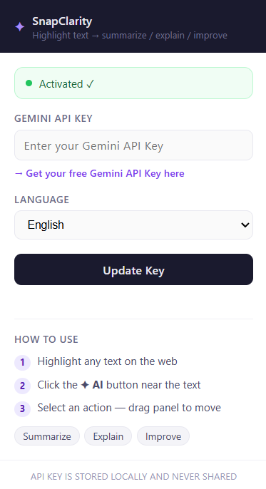
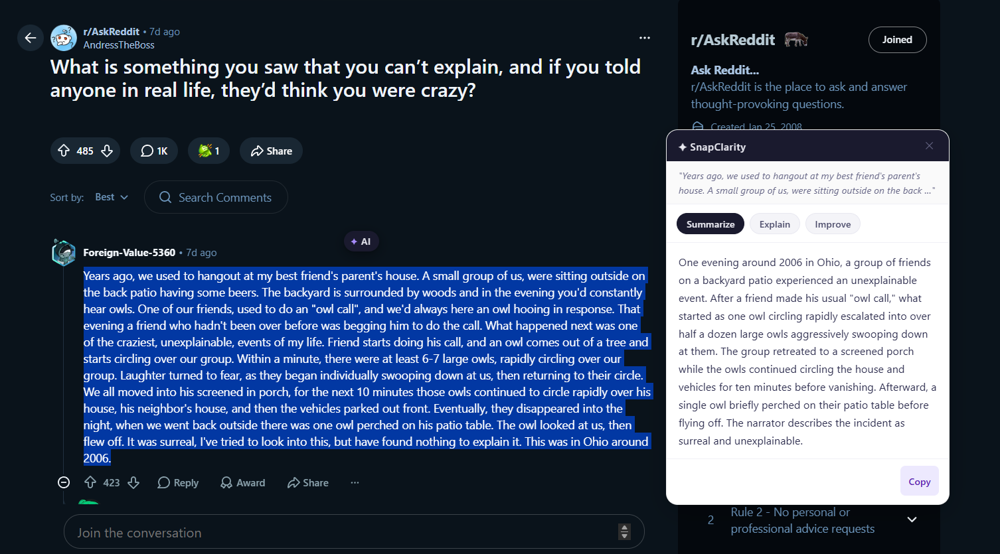

# Highlight → Understand Instantly (No AI tab needed) — Setup Guide

Highlight any text on the web → AI will summarize, explain, or improve it. This extension works directly with the free Google Gemini API and features full multi-language support for both its user interface and AI outputs.

```
User → Extension → Gemini AI API (Free)
```

---

## Demo
https://youtu.be/D4gojP3h1AY?si=kkJcfubJVjSwDBWp

---

## Screenshot


---
## Features

- **Summarize**: Get a concise summary of long articles.
- **Explain**: Simplify complex concepts and difficult text.
- **Improve**: Enhance the grammar, flow, and tone of your writing.
- **Global Language Support**: Select your preferred language (English, Vietnamese, Spanish, French, German, Italian, Portuguese, Russian, Arabic, Hindi, Japanese, Korean, Chinese) and the extension's entire UI, as well as the AI's responses, will instantly localize to match.
- **Bring Your Own Key**: Securely stores your Gemini API key locally in your browser. No middleman servers.

---

## Step 1 — Get your Gemini API Key (Free)

1. Go to [Google AI Studio](https://aistudio.google.com/app/apikey)
2. Click **Create API key** → copy the key.
*(Note: Gemini 1.5/2.5 Flash offers a very generous free tier).*

---

## Step 2 — Install the Extension

1. Open your browser and navigate to the Extensions page:
   - Chrome: `chrome://extensions`
   - Edge: `edge://extensions`
2. Enable **Developer mode** in the top right corner.
3. Click **Load unpacked** and select the `extension/` folder from this project.

---

## Step 3 — Activate and Use

1. Click the **✦ AI Text Assistant** icon in your browser toolbar.
2. Paste your copied API Key into the **Gemini API Key** field.
3. Select your preferred **Language** from the dropdown menu.
4. Click **Activate / Save**.
5. Go to any webpage, highlight some text, and click the floating **✦ AI** button to test it out!

---

## Project Structure

```
ai-text-assistant/
├── extension/
│   ├── manifest.json      # Chrome Extension config
│   ├── background.js      # Service worker — handles Gemini API calls
│   ├── content.js         # Injected script — detects text selection + UI rendering
│   ├── content.css        # Styling for the floating button and panel
│   ├── popup.html         # Settings UI (API key, language selection)
│   ├── popup.js           # Settings logic and dynamic UI localization
│   └── icons/             # Extension icons
```

---

## Supported Languages

- English
- Vietnamese
- Spanish
- French
- German
- Italian
- Portuguese
- Russian
- Arabic
- Hindi
- Japanese
- Korean
- Chinese

---

## Support me here

https://royalnghia.gumroad.com/l/plzuqw

---

## Future Enhancements (Todo)

- [ ] Keyboard shortcut (e.g., Alt+A)
- [ ] Right-click context menu integration
- [ ] History of the 10 most recent results
- [ ] Custom user prompts
- [ ] Dark mode support
